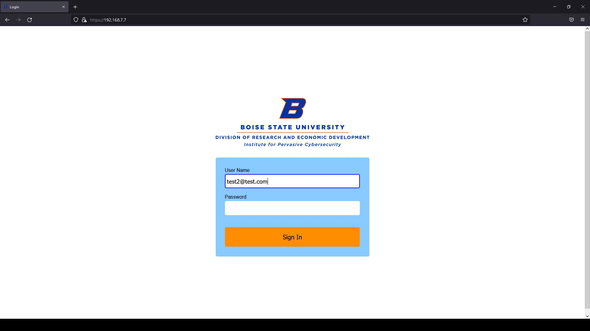
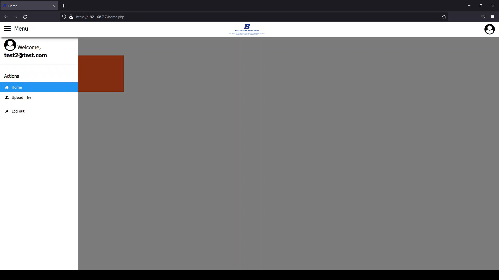
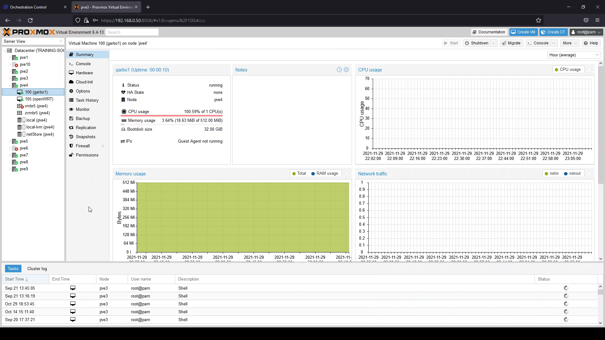
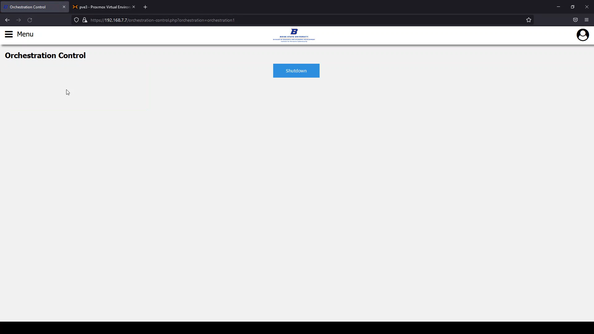
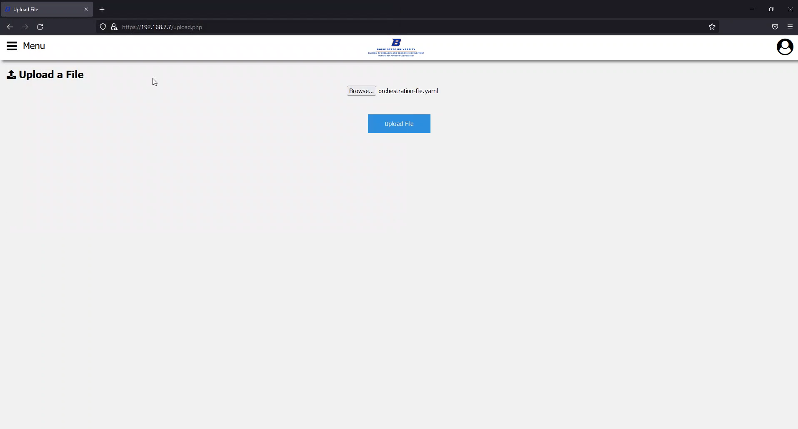
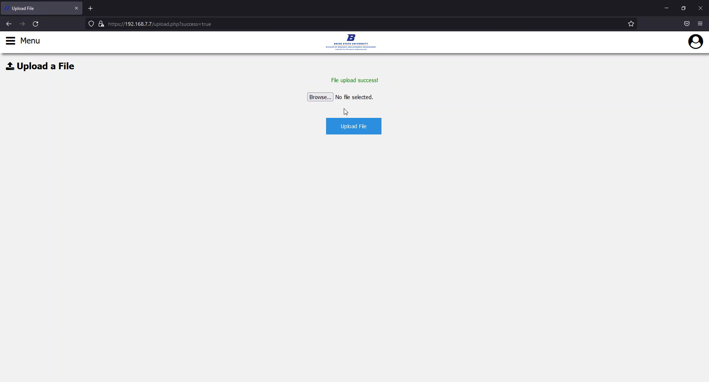

*Developed by Sam Acker & Brielle Young*

## Abstract

The goal of this project was to build a web interface which allows researchers and faculty to login,
configure, and run scenarios within the Institute for Pervasive Cybersecurity (IPC) Virtual City. 

The Virtual City Web Controller provides a convenient way for IPC staff to assign scenarios to faculty members and for faculty members to control and distribute access for those scenarios to their students. This project will help provide a more hands on way for students to learn about cyber attacks, how they work, and how to prevent them.

Our solution leverages both Proxmox and pfSense API functionality to allow users into a particular scenario and access the virtual network within. Proxmox houses the controls to all the virtual machines in the Virtual City and provides a centralized way for our interface to call upon specific virtual machines as needed. pfSense firewalls determine whether a user is able to access a particular scenario. Through our interface, users will have the ability to distribute access to the system and provide OpenVPN credentials to students so they are allowed through our firewalls and have access to the learning environment they were assigned.

## Project Description

For both faculty and IPC admin, we created an interface to be able to access the functionality
we created in our project. In this section, we will outline everything a user is able to do in this project.

The login page greets our users when they first access the site. Only users that specifically have access to our system, including both VPN credentials to our network and credentials to the interface, will be able to log in.

Upon successful login, they are taken to their personalized homepage that lists the orchestrations available to them. Orchestrations are structured files that IPC staff can create to define a scenario for instructors to use. This is what an IPC admin would currently see when logged in (more orchestration files are to be determined later on in the project's life):

The main purpose of our program is to allow both faculty and IPC admins to quickly boot up one or more virtual machines to run a cybersecurity scenario. When clicking on an orchestration file (see homepage image above), it will boot up the specified virtual machines in the order requested within an orchestration file through Proxmox. The machine we requested to boot up in the below image is virtual machine 100 on the pve4 node within the Virtual City cluster.

Users also have the ability to shut down a scenario to free up resources for other users in the system. When starting a scenario, an orchestration shutdown page will be available. When clicked, the virtual machines from the originally requested orchestration file will be shut down.

IPC admin have the ability to upload new orchestration files to the system for users to use. When accessing the designated page, they may select a file for upload. On success, it will be saved in a specific file on the system and a success message will appear on the page.

Faculty can also use our access control panel to manage student access to the scenarios they are given by IPC staff. They can use this interface to add students to a scenario which will automatically email their credentials and give them access to the virtual network via that scenarios VPN server on its edge router. They are also able to remove and list students associated with a particular scenario

## Video Presentation

The video below provides a demonstration of how our project works.

<iframe width="1280" height="720" src="https://www.youtube.com/embed/KBN9EjuZ9fQ" title="YouTube video player" frameborder="0" allow="accelerometer; autoplay; clipboard-write; encrypted-media; gyroscope; picture-in-picture" allowfullscreen></iframe>
