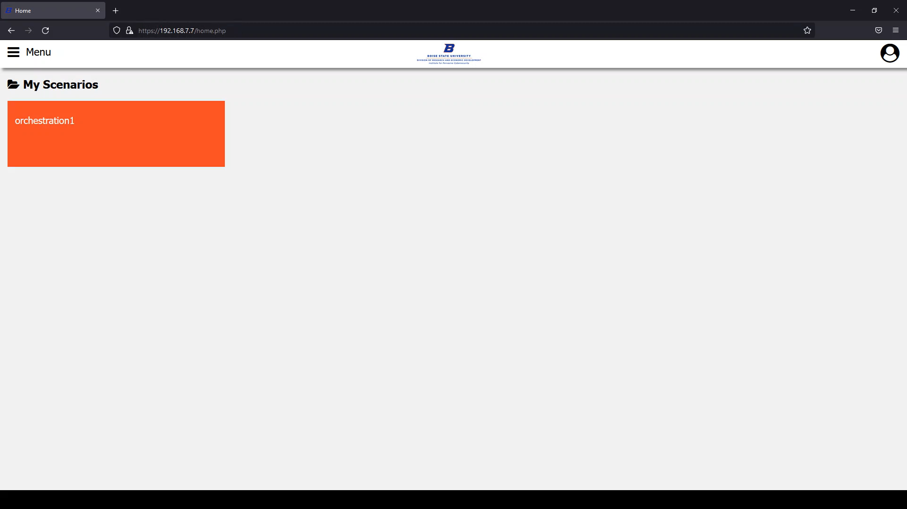

*Developed by Sam Acker & Brielle Young*

## Abstract

The Virtual City Web Controller is an all-in-one way for users to run scenarios for classroom learning purposes. Our interface provides a gateway for both faculty and students to access the resources that have been created by the IPC over the last year. This project will help provide a more hands on way for students to learn about cybersecurity attacks, how they work, and how to prevent them.

Our solution utilizes both Proxmox and pfSense to allow users into the system and access the virtual machines within the Cyberdome. Proxmox houses the controls to all the virtual machines in the Cyberdome and provides a centralized way for our interface to call upon specific virtual machines as needed. pfSense is our firewall and determines whether a user is able to access the system. Through our interface, users will have the ability to distribute access to the system and provide OpenVPN credentials to students so they are allowed through our firewall and have access to the learning materials they were assigned.

## Project Description

For both faculty and IPC admin, we created an interface to be able to access the functionality
we created in our project. In this section, we will outline everything a user is able to do in this project.

The login page greets our users when they first access the site. Only users that specifically have access to our system, including both VPN credentials to our network and credentials to the interface, will be able to log in.

Upon successful login, they are taken to their personalized homepage that lists the orchestrations available to them. This is what an IPC admin would currently see when logged in (more orchestration files are to be determined later on in the project's life):

The main purpose of our program is to allow both faculty and IPC admin quickly boot up one or more virtual machines to run a cybersecurity scenario. When clicking on an orchestration file (see homepage image above), it will boot up the specified virtual machines in the order requested within an orchestration file through Proxmox. The machine we requested to boot up in the below image is virtual machine 100 in the pve4 cluster.

Users also have the ability to shut down a scenario to free up resources for other users in the system. When starting a scenario, an orchestration shutdown page will be available. When clicked, the virtual machines from the originally requested orchestration file will be shut down.

IPC admin have the ability to upload new orchestration files to the system for users to use. When accessing the designated page, they may select a file for upload. On success, it will be saved in a specific file on the system and a success message will appear on the page.

## Video Presentation

The video below provides a demonstration of how our project works.

<iframe width="1280" height="720" src="https://www.youtube.com/embed/KBN9EjuZ9fQ" title="YouTube video player" frameborder="0" allow="accelerometer; autoplay; clipboard-write; encrypted-media; gyroscope; picture-in-picture" allowfullscreen></iframe>
